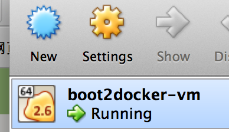
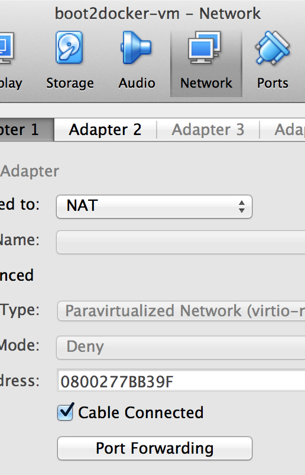
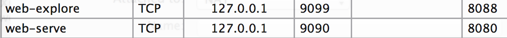
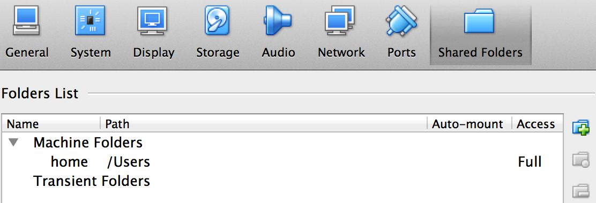
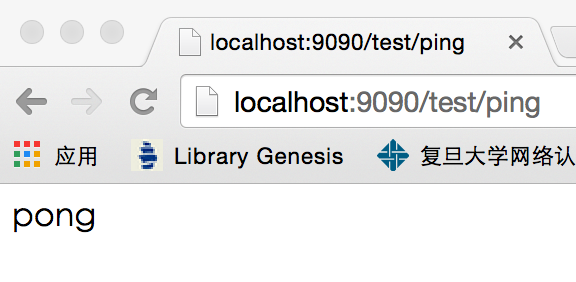

# Pandora Dev Environment
This is a portable web app environment (nginx+uwsgi+flask) built with [docker](https://www.docker.com).

## Prerequisites
* Download & install VirtualBox ( [Official](https://www.virtualbox.org/wiki/Downloads) &nbsp; [Baidu Pan](http://pan.baidu.com/s/1ntJVGfv) )
* Download & install boot2docker ( [Official](http://boot2docker.io/)  &nbsp; [Baidu Pan](http://pan.baidu.com/s/1kTvDpgN) )

## Setup Instruction
For Linux/Mac users, there're some simple scripts written by me. For Windows users, however, you may imitate the way the shell scripts do, where the syntax could be a little bit different.

___You don't have to switch to Linux obligatorily. Just stay in the platform which you are comfortable with, where you're equipped with your familiar IDE or some other tools. That's also one of the benefits of using `docker`.___ So as to the helper scripts, they can be simply rewritten in the syntax of `.bat`.

### Build Image
Look into `build.sh`. You may modify `username` and `image` as you like. Then run it:

```
./build.sh
```

### Setup Ports
Open VirtualBox. Select the vm `boot2docker-vm` (remember to install boot2docker as is instructed at very beginning) --> settings.



Network --> Port Forwarding



Add these two ports. You may change change the host ports if there's any conflict.



### Setup Shared Folder
Mount root of your `sphinx` as shared folder. It is recommended just use the super root `/Users` lazily, rather than `/path/to/sphinx`, as is shown below. The latter one doesn't work for me. Don't know why.



### Run Server
I wrote two convenient scripts: `serve.sh` and `explore.sh` to run the image.

* `serve.sh` will run a web server container, which maps the ports out so that you can test the newly written python code. Reminder: `Ctrl-C` and re-run `serve.sh` if you change any python code.
* `explore.sh` will take you into the container. Note this container is different than the container above. Web serviced is __NOT__ started in this container. You may do any experiment in it.

___Before running the script___, please clone `sphinx` to local, and modify `sphinx_root` in `serve.sh` and `explore.sh`, and __They must be in ABSOLUTE path__.

___NOTE: Anything you do in the container will NOT be saved automatically considering sync of environment among all group members.___ If you must do some customization, remember to commit it using [this](http://docs.docker.com/reference/commandline/cli/#commit)

```
[docker commit [OPTIONS] CONTAINER [REPOSITORY[:TAG]]]
```

### Check Mounting
`sphinx` is mounted to container when running the above scripts. Yet it could fail because boot2docker doesn't support shared folder very well. Run `explore.sh` and check if `sphinx` is mounted as `/opt/sites/sphinx`.

If not, please refer to [this](https://medium.com/boot2docker-lightweight-linux-for-docker/boot2docker-together-with-virtualbox-guest-additions-da1e3ab2465c) blog.

## Test
Run the server by `serve.sh`, open your browser, and go to http://localhost:9090/ping . If you see "pong", everything is done!




__Cheers!__

